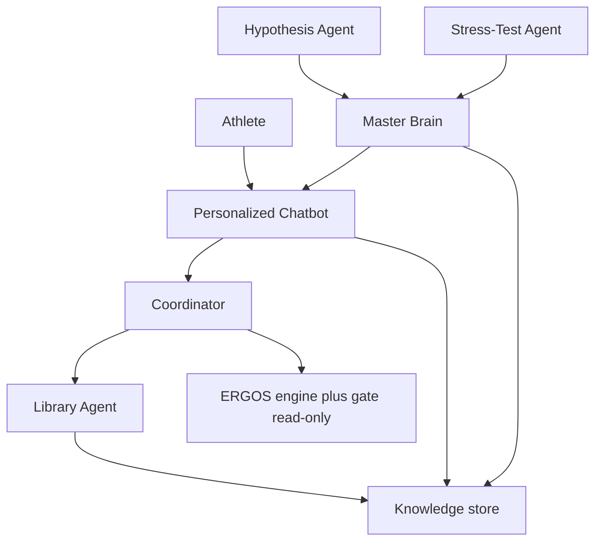

# Architecture

Grokbot is a **human-team org chart**, not six chatbots. The athlete speaks to one coach. Everyone else has a different customer, write permission, and handoff.

## Diagram

Coordinator is **not** a public HTTP route. The Chatbot calls it in-process (or via an internal bus). Library ingest, experiments, stress runs, and releases are **operator** APIs, not athlete APIs.

## Data flow (one athlete turn)

1. Athlete `POST /v1/chat/turns` with text.
2. Chatbot asks Coordinator to classify intent (`explain_rec` | `why_blocked` | `science_q` | `logistics` | `unsafe`).
3. `unsafe` → Chatbot replies with a refusal (its voice) and flags HITL. No library fetch.
4. `explain_rec` / `why_blocked` → Coordinator reads the engine/gate snapshot **read-only** and returns the stored rec + trace. Chatbot rewrites tone; it does not rescore.
5. `science_q` → Coordinator retrieves at most **8** spans from the env’s knowledge pointer. Chatbot cites quotes. If no span qualifies, Chatbot says unknown.
6. Every turn writes `agent_runs` + `chat.turn` telemetry. Citations must resolve to `knowledge_spans` in the current env pointer.

## Permission matrix

| Actor | Athlete-visible text | Read | Write |
| --- | --- | --- | --- |
| Personalized Chatbot | Yes (only speaker) | Env knowledge, engine snapshot, profile/motivators/barriers, rec rows | `agent_runs`, chat turns |
| Coordinator | No | Same as Chatbot, plus intent classifier | `agent_runs` (route traces) |
| Library Agent | No | Raw fetch bytes | `knowledge_docs` / spans at **staging** only |
| Hypothesis Agent | No | Telemetry aggregates, current pointers | Experiment records |
| Stress-Test Agent | No | Staging/canary artifacts, gate fixtures | Reports; never `release_pointers` |
| Master Brain | No (Chatbot may announce a rollback in its voice if a turn is in flight) | Reports, HITL queue | `release_pointers` (`prod` / `canary`), rollback |
| ERGOS engine + gate | N/A | N/A from Grokbot’s perspective | **Forbidden.** Grokbot is read-only |

## Hard boundary (ERGOS)

Copied from the running app, not renegotiated in this spec:

- `runEngine` in `src/lib/engine/engine.ts` decides session / habit / rest candidates.
- `gateExercises` in `src/lib/engine/gate.ts` is the last filter. Contraindicated movements never surface.
- `refreshRecommendations` in `src/lib/ergos/recommendations.ts` persists recs and already gates on `onboarding_step < 4`.
- Grokbot **must not** invent a session, a load, or a substitution. If the engine has nothing pressing, the Chatbot says that.

## Compute budget (moderate)

- One chat model per athlete turn (Coordinator classification may be rules-first; a cheap classifier is allowed but counts toward the one-call budget if it is a model).
- Max 8 retrieved chunks.
- Embeddings for ingest are batch/nightly, not per keystroke.
- No fine-tunes in this spec. No always-on extra frontier models.

## Human-team mapping

| Human role | Agent | Customer | Must not |
| --- | --- | --- | --- |
| Coach | Personalized Chatbot | Athlete | Invent loads or skip the gate |
| Front desk | Coordinator | Chatbot | Speak to the athlete |
| Librarian | Library Agent | Knowledge store | Promote to prod |
| Sport scientist | Hypothesis Agent | Master Brain | Edit `blocks_patterns` or weights without HITL |
| QA | Stress-Test Agent | Master Brain | Ship on a failed suite |
| Release owner | Master Brain | Prod pointers | Auto-promote `clinical` |
